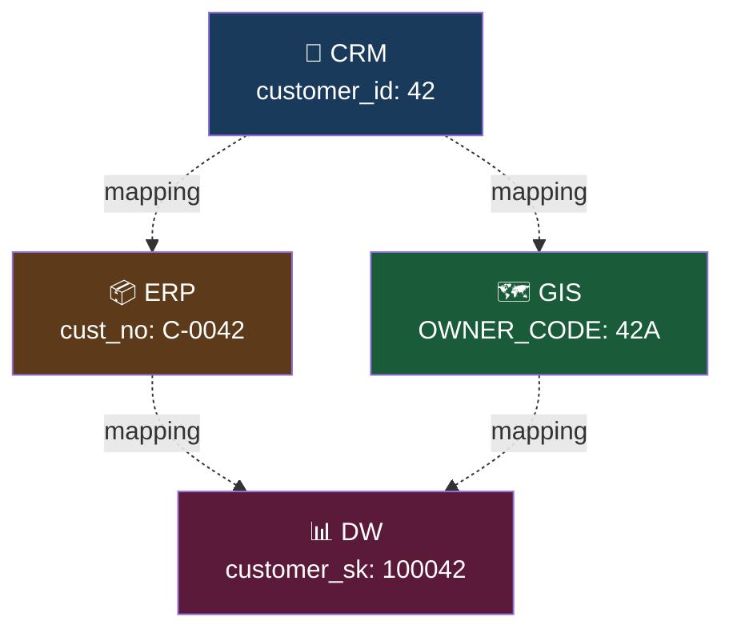
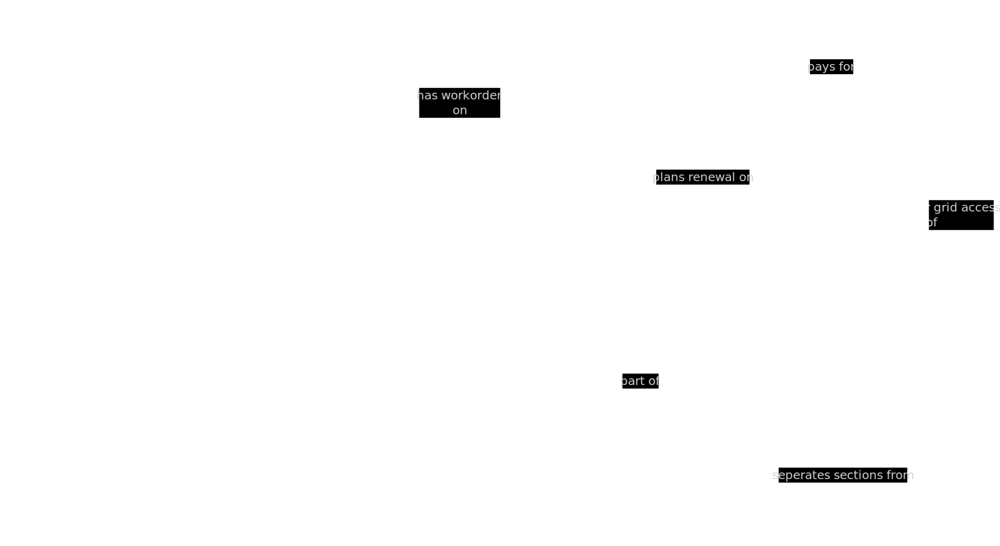
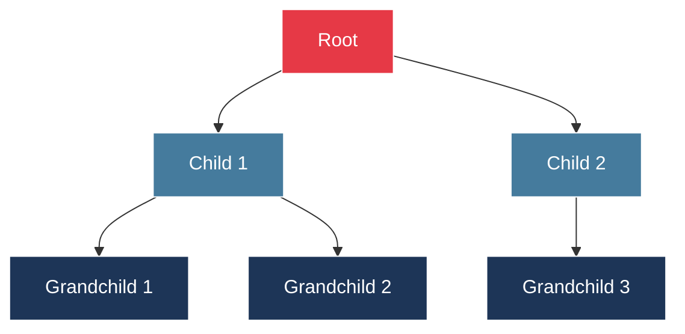
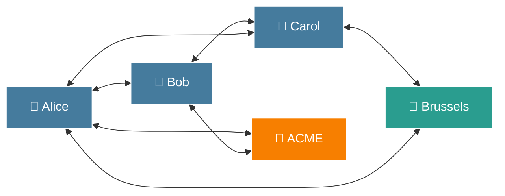
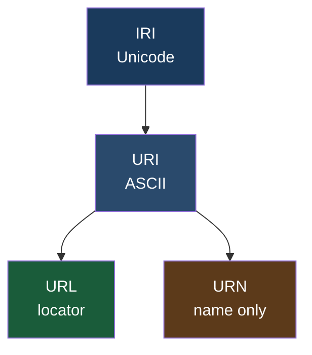
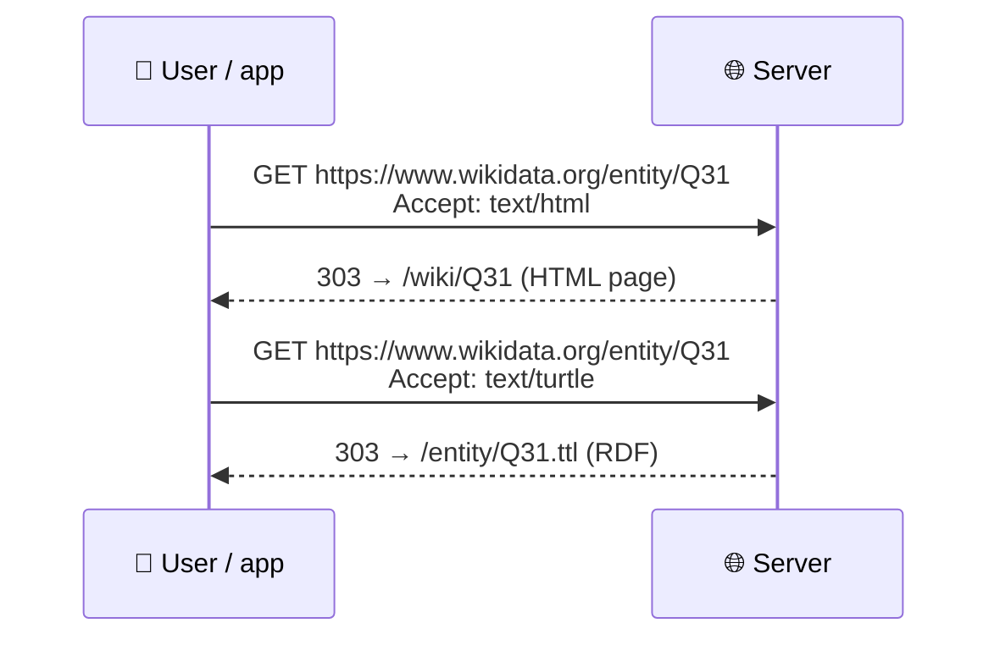
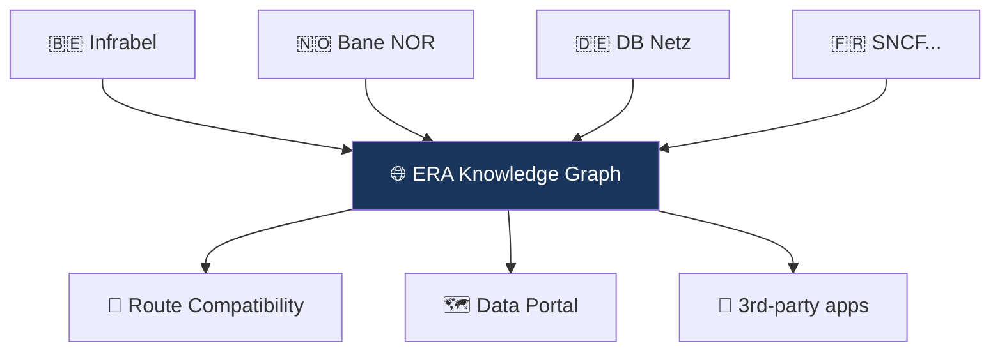
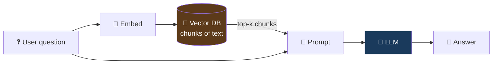
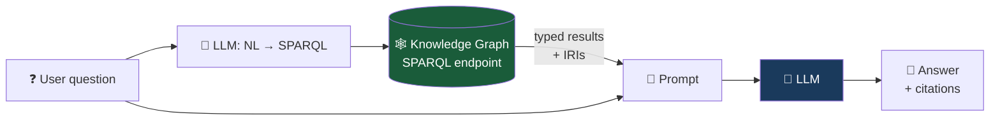

# 🔗 Linked Data

## A Hands-on Introduction

<div class="text-gray-400 mt-4">
A 4-hour workshop · Concepts, ontologies, SPARQL, SHACL — and lots of TTL
</div>

<div class="abs-bottom m-6 flex gap-2 justify-center text-sm opacity-75">
  <span>Mathias Vanden Auweele · <a href="https://matdata.eu/">matdata.eu</a></span>
</div>

<!--
Welcome! Today we'll go from "what is a triple?" to hands-on writing, querying and validating RDF.
Plan to alternate theory and exercises roughly every 30–40 minutes.
-->

---
layout: two-cols
---

# 👋 Hello, I am Mathias

<div class="text-sm mt-2">

- 🧑 Independent consultant on **railway data** with a linked data preference
- 🛤️ Current & past work: ERA RINF, Bane NOR DIM, Infrabel, railML
- 💻 Open source: <a href="https://yasgui.matdata.eu/">yasgui.matdata.eu</a>, Docker Jena+GeoSPARQL, [tp-lib](https://github.com/Matdata-eu/tp-lib), [uri-dereferencer](https://github.com/Matdata-eu/uri-dereferencer), [W3C CG Facade-X](https://github.com/w3c-facade-x)
- 🌐 Website: **<a href="https://matdata.eu/">matdata.eu</a>**
- 📫 Reach me: through my website

</div>

<div class="mt-6 p-3 bg-blue-50 dark:bg-blue-900 rounded text-gray-800 dark:text-gray-100 text-sm">
💬 <strong>Today's promise:</strong> by the end, you will have <em>written</em>, <em>validated</em> and <em>queried</em> RDF — not just read about it.
</div>

::right::

<div class="flex flex-col items-center mt-2 gap-2">
  
  <span class="text-xs text-gray-400">github.com/Matdata-eu</span>
</div>

<!--
Short personal intro. Keep this under 2 minutes.
-->

---
layout: default
---

# 🗓️ Agenda — 4 hours

<div class="grid grid-cols-2 gap-6 mt-2 text-sm">
<div>

| # | Block | ~Time |
|---|-------|-------|
| 1 | 👋 Intro & why Linked Data | 20 min |
| 2 | 🔑 IRIs — the global identifiers | 25 min |
| 3 | 🧱 RDF: triples, literals, blank nodes | 20 min |
| 4 | 📝 Turtle & serializations | 15 min |
| 5 | 🧪 **Hands-on 1** — Describe yourself in TTL | 25 min |
| 6 | 🌍 Real-world knowledge graphs | 25 min |

</div>
<div>

| # | Block | ~Time |
|---|-------|-------|
| 7 | 📚 Ontologies & vocabularies | 20 min |
| 8 | 🔎 SPARQL basics | 20 min |
| 9 | 🧪 **Hands-on 2** — Query ERA RINF | 20 min |
| 10 | ✅ SHACL validation | 15 min |
| 11 | 🧪 **Hands-on 3** — Validate your TTL | 15 min |
| 12 | � Linked Data & LLMs | 15 min |
| 13 | 🧰 Tools, publishing, wrap-up | 10 min |

</div>
</div>

<!--
Don't read this out — just orient the room. Breaks are flexible, adjust to energy.
-->

---
layout: section
---

# Part 1 — Why Linked Data?

<div class="absolute bottom-6 left-0 right-0 text-center text-xs text-gray-400">
  <span class="font-semibold text-white">① Why</span> · ② RDF · ③ Turtle · ④ Examples · ⑤ Ontologies · ⑥ SPARQL · ⑦ SHACL · ⑧ Wrap-up
</div>

---
layout: two-cols
---

# 🧩 The data silo problem

Every organisation has:

<v-clicks>

- 📇 A CRM
- 🗄️ An ERP
- 🗺️ A GIS
- 📊 A data warehouse
- 📁 A shared drive full of Excel files
- 🤖 And now a RAG pipeline on top of all of this

</v-clicks>

<v-click>

<div class="mt-6 p-3 bg-red-50 dark:bg-red-900 rounded text-gray-800 dark:text-red-100 text-sm">
❌ Same "customer", "station", "product" — <strong>different identifiers in every system</strong>.<br/>
❌ Joining them = custom ETL, mapping tables, fragile glue code.
</div>

</v-click>

::right::

<v-click>



</v-click>


---
layout: default
---

# 🚂 The Railway Data Problem

We have such a beautiful system…



---
layout: default
---

# 🚂 The Railway Data Problem

But we decided to break it into pieces we call "use cases"…


---
layout: default
---

# 🎯 What Linked Data gives you

<v-clicks>

- 🔑 **Global identifiers** (IRIs) — no more mapping tables
- 🕸️ **Graph model** — follow links across datasets
- 📚 **Shared vocabularies** — meaning travels with the data
- 🔗 **Dereferenceable** — the identifier *is* the documentation
- 🛠️ **Standard stack** — RDF, SPARQL, SHACL, OWL (W3C)
- 🌍 **Interoperable by design** — built for the Web

</v-clicks>

<!--
5-star model is the classic framing. Most "open data" stops at 3 stars — CSV on a portal. Linked Data is 4–5 stars.
-->

---
layout: two-cols
---

# 🌲 Tree vs 🕸️ Graph



<div class="text-xs text-center">Hierarchy — one parent, one way</div>

::right::



<div class="text-xs text-center">Network — many relations, multi-directional</div>

<div class="text-xs mt-4 opacity-75">
💡 Reality is a graph. Trees are a convenient but lossy projection.
</div>

<!--
XML and JSON force you into a tree. RDF lets reality be a graph.
-->

---
layout: section
---

# Part 2 — IRIs

The global identifier system

---
layout: default
---

# 🔑 IRIs — the global identifiers

An **IRI** (Internationalised Resource Identifier) identifies a resource *globally*.

```turtle
<https://matdata.eu/#me>                 # me, the person
<https://www.wikidata.org/entity/Q31>    # Belgium, on Wikidata
<https://schema.org/Person>              # the concept "Person"
<http://data.europa.eu/949/BEFBMZ>       # Brussels-Midi station (ERA)
<urn:isbn:9780140328721>                 # The BFG, by Roald Dahl
```

<v-clicks>

- 🌍 **Global** — no naming collisions across organisations or datasets
- 🧩 **Reusable** — anyone, anywhere can say something about the same IRI
- 🔗 **Dereferenceable** (ideally) — open it in a browser, get documentation
- ♾️ **Forever** — a good IRI is stable for decades

</v-clicks>

<v-click>

<div class="mt-4 p-3 bg-yellow-50 dark:bg-yellow-900 rounded text-gray-800 dark:text-gray-100 text-sm">
🗝️ <strong>The single most important idea in Linked Data:</strong> if we all agree to use the <em>same IRI</em> for the same thing, our data merges by itself.
</div>

</v-click>

<!--
Before IRIs: every system had its own customer ID, product SKU, station code. Integration = mapping tables.
After IRIs: the ID is the integration.
-->

---
layout: two-cols
---

# 🧬 Anatomy of an IRI

```
  https://www.wikidata.org/entity/Q31#this
  └─┬─┘   └────────┬────────┘└───┬──┘ └┬─┘
  scheme     authority        path  fragment
```

<v-clicks>

- **scheme** — `https`, `http`, `urn`, `did`, `tag`, …
- **authority** — who *governs* this IRI space (DNS name usually)
- **path** — the local identifier inside that authority
- **fragment** (`#…`) — a sub-part of the document; never sent to the server
- **query** (`?…`) — rarely used in IRIs; avoid in identifiers

</v-clicks>

::right::

<v-click>

### 🔤 The "I" in IRI

URIs are ASCII-only. **IRIs allow Unicode**:

```turtle
<https://matdata.eu/people/松本#me>
<https://example.org/ville/Liège>
<https://example.org/🍕>   # technically valid. please don't.
```

Under the hood an IRI is %-encoded into a URI when it hits the wire.

</v-click>

<v-click>

<div class="mt-4 p-2 bg-blue-50 dark:bg-blue-900 rounded text-gray-800 dark:text-gray-100 text-xs">
💡 In practice <strong>99 % of Linked Data IRIs are HTTPS URLs</strong>. The rest of this deck calls them "IRIs" but you can read "URL".
</div>

</v-click>

---
layout: default
---

# 🌀 URI vs URL vs URN vs IRI

The terminology is genuinely confusing. Here's the short version:

<div class="grid grid-cols-2 gap-4 mt-4 text-sm">
<div class="bg-gray-100 dark:bg-gray-800 rounded p-3">

**URI** — Uniform Resource **Identifier**  
The umbrella. Names a thing.

**URL** — Uniform Resource **Locator**  
A URI that also *tells you where to fetch it*.

**URN** — Uniform Resource **Name**  
A URI that *only* names, never locates. `urn:isbn:…`, `urn:uuid:…`

**IRI** — **Internationalised** Resource Identifier  
Same as URI, but Unicode-capable.

</div>
<div>



</div>
</div>

---
layout: default
---

# 🔗 Dereferenceable IRIs & content negotiation

**Dereferenceable** = you can paste the IRI in a browser and get something useful back.



---
layout: default
---

# 🔗 Dereferenceable IRIs & content negotiation

<v-clicks>

- 🤝 The **same IRI** serves humans (HTML) and machines (Turtle, JSON-LD, N-Triples)
- 🧭 The `Accept:` header drives the redirect — classic HTTP, no magic
- 🪝 Try it yourself: `curl -LH "Accept: text/turtle" https://www.wikidata.org/entity/Q31`
- 🏷️ The "303 See Other" pattern distinguishes **the thing** from **a document about the thing**

</v-clicks>

---
layout: default
---

# 🧊 "Cool URIs don't change"

Tim Berners-Lee, 1998 — still the rulebook ([W3C note](https://www.w3.org/Provider/Style/URI)).

<div class="grid grid-cols-2 gap-6 mt-4 text-sm">
<div>

**✅ Do**


- Use your **own domain** you control (you're committing for decades)
- Keep IRIs **opaque** — no tech details (`.php`, `.aspx`) or version numbers
- Use **lowercase**, ASCII-safe slugs; avoid spaces & punctuation
- Pick a **pattern** and stick to it (`/entity/Q31`, `/book/9780140328721`)
- Plan **redirects** forever — if something moves, 301 it

</div>
<div>

**❌ Don't**

- Don't embed the **implementation** (`/cgi-bin/lookup.pl?id=42`)
- Don't use **session IDs** or timestamps in IRIs
- Don't use **ephemeral domains** (company mergers, product rebrands)
- Don't reuse an IRI for a different thing — ever
- Don't mint an IRI you can't host forever; **prefer existing ones** (Wikidata, DOI, ORCID…)

</div>
</div>

---
layout: default
---

# 🏛️ IRIs in the wild — patterns to reuse

<div class="grid grid-cols-2 gap-4 text-xs">
<div class="bg-gray-100 dark:bg-gray-800 rounded p-3">

**People & organisations**

- 🆔 **ORCID** — `https://orcid.org/0000-0002-1825-0097`
- 🌐 **ROR** (orgs) — `https://ror.org/02catss52`
- 🧑 **Wikidata Q** — `https://www.wikidata.org/entity/Q937` (Einstein)

**Publications & works**

- 📄 **DOI** — `https://doi.org/10.1000/182`
- 📚 **ISBN** — `urn:isbn:9780140328721`
- 🎞️ **IMDb → Wikidata** — better to link via `wdt:P345`

</div>
<div class="bg-gray-100 dark:bg-gray-800 rounded p-3">

**Concepts & vocabularies**

- 🏷️ **schema.org** — `https://schema.org/Person`
- 🧭 **SKOS / thesauri** — `http://vocabularies.unesco.org/thesaurus/concept123`
- 🌍 **GeoNames** — `https://sws.geonames.org/2802361/` (Brussels)

**Domain data**

- 🚂 **ERA** — `http://data.europa.eu/949/BEFBMZ`
- 🧬 **UniProt** — `http://purl.uniprot.org/uniprot/P12345`
- 🌐 **EU publications** — `http://publications.europa.eu/resource/authority/country/BEL`

</div>
</div>

<v-click>

<div class="mt-4 p-3 bg-green-50 dark:bg-green-900 rounded text-gray-800 dark:text-gray-100 text-sm">
♻️ <strong>Reuse before you mint.</strong> Every time you use a Wikidata / DOI / ORCID IRI, your data joins a global graph for free.
</div>

</v-click>

---
layout: section
---

# Part 3 — RDF

**The triple model**

---
layout: default
---

# 🧱 The RDF triple

Everything in RDF is a statement of the form:

<div class="text-center text-2xl mt-6 mb-4">
<span class="text-blue-400">Subject</span> ──
<span class="text-green-400">Predicate</span> ──▶
<span class="text-orange-400">Object</span>
</div>

<div class="text-center text-lg opacity-75">"Alice knows Bob" · "Brussels is located in Belgium" · "This book has author 'Eco'"</div>

```turtle
<https://matdata.eu/#me>  foaf:name     "Mathias" .
<https://matdata.eu/#me>  foaf:knows    <https://example.org/alice> .
<https://matdata.eu/#me>  schema:worksFor <https://example.org/matdata> .
```

<v-click>

<div class="mt-4 p-3 bg-blue-50 dark:bg-blue-900 rounded text-gray-800 dark:text-gray-100 text-sm">
💡 A <strong>graph</strong> is just a (large) set of triples. That's it. No hierarchy. No root.
</div>

</v-click>

<!--
Whiteboard this. Three dots and two arrows. That's the entire data model.
-->

---
layout: default
---

# 🏷️ Literals

The **object** of a triple can also be a literal value — a string, number, date, etc.

```turtle
<https://matdata.eu/#me>
    foaf:name        "Mathias Vanden Auweele" ;         # plain string
    foaf:name        "Mathias Vanden Auweele"@en ;      # language-tagged
    schema:birthDate "1988-07-14"^^xsd:date ;           # typed literal
    schema:height    1.82 ;                              # number (xsd:decimal)
    schema:active    true .                              # xsd:boolean
```

<v-clicks>

- 🔤 **Plain strings** — quoted text
- 🌐 **Language tags** — `"Brussel"@nl`, `"Bruxelles"@fr`, `"Brussels"@en`
- 🧮 **Datatypes** — from XML Schema: `xsd:integer`, `xsd:date`, `xsd:dateTime`, `xsd:boolean`, …
- ⚠️ Literals cannot be the **subject** of a triple. Only IRIs (and blank nodes) can.

</v-clicks>

---
layout: default
---

# 🫥 Blank nodes

Sometimes you need a node that has no global identity — an anonymous "helper" node.

```turtle
<https://matdata.eu/#me>
    schema:address [                    # blank node, anonymous
        a schema:PostalAddress ;
        schema:streetAddress "Rue de la Loi 42" ;
        schema:addressLocality "Brussels" ;
        schema:postalCode "1000"
    ] .
```

<v-clicks>

- ✅ Great for structured values (addresses, coordinates, lists)
- ⚠️ Cannot be referenced from outside the file — no global identity
- 💡 Use an IRI whenever a node might be referenced elsewhere

</v-clicks>
---
layout: section
---

# Part 4 — Turtle

The friendly serialization

---
layout: default
---

# 📝 RDF serializations

RDF is a **data model**, not a file format. Many serializations exist:

<div class="grid grid-cols-2 gap-4 mt-2 text-sm">
<div>

| Format | Extension | Vibe |
|--------|-----------|------|
| **Turtle** | `.ttl` | ⭐ Human-friendly |
| **N-Triples** | `.nt` | One triple per line, great for streaming |
| **JSON-LD** | `.jsonld` | JSON — great for Web APIs |
| **RDF/XML** | `.rdf` | Legacy, verbose |
| **TriG** / **N-Quads** | `.trig` / `.nq` | Turtle/N-Triples + named graphs |

</div>
<div>

<v-click>

```turtle
# Turtle
@prefix schema: <https://schema.org/> .
<#me> a schema:Person ;
      schema:name "Mathias" .
```

```json
// JSON-LD
{
  "@context": "https://schema.org",
  "@id": "#me",
  "@type": "Person",
  "name": "Mathias"
}
```

```turtle
# N-Triples
<#me> <rdf:type> <schema:Person> .
<#me> <schema:name> "Mathias" .
```

</v-click>

</div>
</div>

<!--
All of these represent the exact same graph. Choose based on context.
-->

---
layout: default
---

# 📝 Turtle — the essentials

```turtle
@prefix schema: <https://schema.org/> .
@prefix foaf:   <http://xmlns.com/foaf/0.1/> .
@prefix xsd:    <http://www.w3.org/2001/XMLSchema#> .

<https://matdata.eu/#me>
    a              schema:Person ;              # 'a' means rdf:type
    schema:name    "Mathias Vanden Auweele" ;
    schema:jobTitle "Consultant"@en ,
                    "Consultant"@fr ;           # comma = same subject + predicate
    schema:url     <https://matdata.eu/> ;
    foaf:knows     <https://example.org/alice>,
                   <https://example.org/bob> .
```

<v-clicks>

- **`@prefix`** — shorten long IRIs
- **`a`** — syntactic sugar for `rdf:type`
- **`;`** — same subject, new predicate
- **`,`** — same subject + predicate, new object
- **`.`** — end of statement
- **`#`** — comment to end of line

</v-clicks>

---
layout: default
---

# 🧱 Schema.org — your friend for "Person"

[schema.org](https://schema.org/) is a **massive shared vocabulary** originally from Google/Bing/Yahoo/Yandex to mark up Web pages. It is perfect for our first exercise.

<div class="grid grid-cols-2 gap-6 mt-4 text-sm">
<div>

**Classes you'll likely use:**

- `schema:Person`
- `schema:Organization`
- `schema:PostalAddress`
- `schema:Place`
- `schema:Country`
- `schema:EducationalOrganization`

</div>
<div>

**Properties for a Person:**

- `schema:name`, `schema:givenName`, `schema:familyName`
- `schema:email`, `schema:telephone`, `schema:url`
- `schema:jobTitle`, `schema:worksFor`
- `schema:birthDate`, `schema:birthPlace`, `schema:nationality`
- `schema:knowsLanguage`, `schema:knowsAbout`
- `schema:address`, `schema:homeLocation`
- `schema:alumniOf`, `schema:sameAs`

</div>
</div>

<div class="mt-4 text-sm opacity-75">
💡 Browse the full catalog at <a href="https://schema.org/Person">schema.org/Person</a>.
</div>

---
layout: section
---

# 🧪 Hands-on 1

**Describe yourself in Turtle**

---
layout: default
---

# 🧪 Exercise 1 — Your turn!

**Goal:** write a valid Turtle file that describes *you*, using `schema.org`.

<div class="grid grid-cols-2 gap-6 mt-2 text-sm">
<div>

**Must include:**

- ✅ `@prefix` declarations for `schema:` and `xsd:`
- ✅ An IRI for yourself (e.g. `<https://example.org/people/yourname#me>`)
- ✅ `a schema:Person`
- ✅ `schema:name` (with a language tag)
- ✅ Your `schema:jobTitle` and `schema:worksFor` (as an IRI of an `schema:Organization` block)
- ✅ A `schema:PostalAddress` as a nested blank node
- ✅ At least two `schema:knowsLanguage` values
- ✅ A `schema:sameAs` link to your LinkedIn / GitHub / Mastodon IRI

</div>
<div>

**Then validate the syntax online:**

1. Open <a href="https://felixlohmeier.github.io/turtle-web-editor/">turtle-web-editor</a>  
   *(just paste and click "Validate")*
2. Alternative: <a href="https://marketplace.visualstudio.com/items?itemName=stardog-union.stardog-rdf-grammars">Install vscode extension: Stardog RDF Grammars</a>  

**Stretch goals:**

- 🌟 Add a `schema:knowsAbout` with an IRI from Wikidata  
  (e.g. `<https://www.wikidata.org/entity/Q8366>` = "algorithm")
- 🌟 Add `foaf:knows` to a neighbour's IRI

</div>
</div>

<div class="mt-4 p-3 bg-blue-50 dark:bg-blue-900 rounded text-gray-800 dark:text-gray-100 text-sm">
Raise your hand if the validator is unhappy — common errors are prefix typos and missing dots.
</div>

<!--
Walk around. Most common mistakes:
- Missing final '.' on last statement
- Using http://schema.org vs https://schema.org — both work but be consistent
- Forgetting the '@' in @prefix
- Using single quotes instead of double quotes
-->

---
layout: default
---

# ✅ Solution — Exercise 1

```turtle
@prefix schema: <https://schema.org/> .
@prefix foaf:   <http://xmlns.com/foaf/0.1/> .
@prefix xsd:    <http://www.w3.org/2001/XMLSchema#> .
@prefix wd:     <https://www.wikidata.org/entity/> .

<https://example.org/people/mathias#me>
    a                    schema:Person ;
    schema:name          "Mathias Vanden Auweele"@en ;
    schema:givenName     "Mathias" ;
    schema:familyName    "Vanden Auweele" ;
    schema:jobTitle      "Independent consultant"@en ;
    schema:worksFor      <https://matdata.eu/#org> ;
    schema:knowsLanguage "nl", "en", "fr" ;
    schema:knowsAbout    wd:Q54872 ,        # Linked Data
                         wd:Q54504 ;        # Semantic Web
    schema:address       [
        a                     schema:PostalAddress ;
        schema:addressLocality "Brussels" ;
        schema:addressCountry  "BE"
    ] ;
    schema:url           <https://matdata.eu/> ;
    schema:sameAs        <https://github.com/Matdata-eu> ,
                         <https://www.linkedin.com/in/mathiasvda/> ;
    foaf:knows           <https://example.org/people/alice#me> .

<https://matdata.eu/#org>
    a              schema:Organization ;
    schema:name    "Matdata" ;
    schema:url     <https://matdata.eu/> .
```

<!--
Show the validated output. Point out: commas, semicolons, blank nodes, language tags, datatypes.
-->

---
layout: default
---

# 🧠 What you just did

<v-clicks>

- ✅ Wrote an RDF graph by hand
- ✅ Used a **shared vocabulary** (`schema.org`) — so any system that knows schema.org understands your data
- ✅ Used **IRIs** to link to external resources (Wikidata, your LinkedIn)
- ✅ Used a **blank node** for the postal address
- ✅ **Validated** the syntax against the Turtle W3C spec

</v-clicks>

<v-click>

<div class="mt-4 p-3 bg-green-50 dark:bg-green-900 rounded text-gray-800 dark:text-gray-100 text-sm">
🎉 If you saved this as <code>me.ttl</code> and hosted it at your URL, the world could <strong>query</strong> it, <strong>follow</strong> its links and <strong>merge</strong> it with other graphs — no API required.
</div>

</v-click>

---
layout: section
---

# Part 5 — Real-world knowledge graphs

Where is Linked Data actually running in production?

---
layout: two-cols
---

# 🌐 Wikidata

The largest general-purpose open knowledge graph.

<v-clicks>

- 🏛️ Operated by the Wikimedia Foundation (sister project of Wikipedia)
- 📊 **~115 million items**, **~1.6 billion triples**
- 🌍 Multilingual by design (every label in hundreds of languages)
- 🔎 Public SPARQL endpoint: <a href="https://query.wikidata.org/">query.wikidata.org</a>
- 🤖 Backs the "knowledge card" you see in Siri, Alexa, Google

</v-clicks>

::right::

```turtle
wd:Q31                               # Belgium
    rdfs:label      "België"@nl,
                    "Belgique"@fr,
                    "Belgium"@en ;
    wdt:P31         wd:Q3624078 ;    # instance of sovereign state
    wdt:P30         wd:Q46 ;         # continent: Europe
    wdt:P36         wd:Q239 ;        # capital: Brussels
    wdt:P1082       11584008 .       # population
```

<div class="text-xs mt-3 opacity-75">
💡 Every Wikipedia article has a Wikidata IRI. Use it as your "ground truth" identifier.
</div>

<!--
Wikidata is the usual entrypoint. Free, CC0, huge.
-->

---
layout: two-cols
---

# 📚 DBpedia

Extracted structured data from Wikipedia infoboxes.

<v-clicks>

- 🏛️ Community-run since 2007
- 📊 ~400 million facts, updated from Wikipedia dumps
- 🔎 SPARQL endpoint: <a href="https://dbpedia.org/sparql">dbpedia.org/sparql</a>
- 🧩 Historical hub of the **Linked Open Data Cloud** — many datasets link to DBpedia IRIs
- 🤝 Complementary to Wikidata (not a replacement)

</v-clicks>

::right::

```turtle
<http://dbpedia.org/resource/Brussels>
    dbo:country    <http://dbpedia.org/resource/Belgium> ;
    dbo:populationTotal 1218255 ;
    dbo:areaTotal  1.62e+08 ;
    rdfs:label     "Brussels"@en,
                   "Bruxelles"@fr,
                   "Brussel"@nl ;
    owl:sameAs     wd:Q239 .
```

<!--
DBpedia vs Wikidata: DBpedia extracts from the infobox on the English Wikipedia. Wikidata is curated directly.
Both endpoints alive — often queried federatively.
-->

---
layout: two-cols
---

# 🚂 ERA Knowledge Graph (RINF)

**European Union Agency for Railways**

<v-clicks>

- 🗺️ Topology + characteristics of ~230 000 km of European rail
- 🏛️ Mandated by EU 2019/773 — **RDF is the legal format** from 31 March 2026
- 📥 ~600 Infrastructure Managers push data (via Dataset Manager)
- 🔎 Public endpoint: <a href="https://rinf.data.era.europa.eu/">rinf.data.era.europa.eu</a>
- 🧭 Used for route compatibility, journey planning, safety cases

</v-clicks>

::right::



<div class="text-xs mt-3 opacity-75">
A textbook case: many independent data producers, one shared ontology, cross-border queries that were impossible before.
</div>

---
layout: two-cols
---

# 🛤️ Infrabel & Bane NOR — DIM

Individual Infrastructure Managers building **internal** knowledge graphs.

<v-clicks>

- 🇳🇴 **Bane NOR DIM** (Digital Infrastructure Model)
  - ~10 million triples on Norwegian rail
  - https://data.banenor.no/
- 🇧🇪 **Infrabel** — similar journey, started from a data centric approach
- 🔗 Both export to ERA in RDF format for RINF

</v-clicks>

::right::

<v-click>

<div class="mt-4 p-3 bg-gray-100 dark:bg-gray-800 rounded text-sm">

**Why a graph?**

- Railway infrastructure *is* a network
- Thousands of cross-cutting concerns: signals, power, detection, …
- Tree/XML formats are not flexible and don't leverage W3C standards
- Enables **"one query, all domains"**

</div>

</v-click>

<!--
Railway data is a textbook case because the physical system really is a graph: tracks connect at switches, signals sit on tracks, tunnels span tracks.
-->

---
layout: two-cols
---

# 🧬 Life sciences

The original Linked Data power users.

- 🧫 **Bio2RDF** — 11 billion triples across 35+ datasets
- 💊 **UniProt** — protein database, public SPARQL endpoint
- 🦠 **ChEMBL, PubChem, Reactome** — all RDF-native
- 🧠 **Gene Ontology (GO)** — the archetype of a domain ontology

::right::

<div class="mt-4 text-sm">

**Why linked data in life sciences?**

- Every gene/protein/drug has ~10 synonymous IDs across databases
- Global IRIs kill the mapping problem
- Cross-dataset queries are daily business:  
  *"For all proteins binding drug X, show related diseases"*

</div>

<div class="mt-4 p-3 bg-gray-100 dark:bg-gray-800 rounded text-sm">

> Fun fact: UniProt has served federated SPARQL queries since **2014** — predating most enterprise KG projects by a decade.

</div>

---
layout: default
---

# 🏛️ Cultural heritage & government

<div class="grid grid-cols-2 gap-6 text-sm">
<div>

**Cultural heritage**

- 🎨 **Europeana** — 60M+ cultural objects, EDM ontology
- 🖼️ **Rijksmuseum**, **British Museum**, **Smithsonian** — open SPARQL endpoints
- 📖 **Library of Congress** — authority files, subject headings
- 🎶 **MusicBrainz** — JSON-LD on every artist/release page

</div>
<div>

**Government & public sector**

- 🇪🇺 **EU Publications Office (Cellar)** — all EU legislation as RDF
- 🇳🇱 **kadaster.nl**, 🇫🇷 **data.gouv.fr**, 🇬🇧 **data.gov.uk** — linked data portals
- 🏛️ **Statistics offices** — RDF Data Cube vocabulary
- 🌍 **data.europa.eu** — all EU open data, DCAT-AP as RDF

</div>
</div>

<div class="mt-6 p-3 bg-blue-50 dark:bg-blue-900 rounded text-gray-800 dark:text-gray-100 text-sm">
💡 Look up any EU directive — its metadata is a SPARQL query away on <a href="https://publications.europa.eu/webapi/rdf/sparql">publications.europa.eu</a>.
</div>

---
layout: two-cols
---

# 📰 BBC & Springer Nature

Media & publishing.

- 📺 **BBC** "Dynamic Semantic Publishing"  
  The 2010 World Cup site was the proof-of-concept: every page was built from SPARQL queries against an internal KG.
- 📚 **Springer Nature SciGraph**  
  Millions of articles, authors, affiliations, grants — all linked.
- 📰 **The New York Times** — published their vocabulary as LOD.
- 🎬 **IMDb** — consumed by Wikidata's film items.

::right::

<div class="mt-4 p-3 bg-gray-100 dark:bg-gray-800 rounded text-sm">

> *"We used to have 32 CMSs, one per subject. Now we have 1 graph and 32 views on it."*  
> — BBC Sport engineering blog, 2012

</div>

<div class="mt-4 text-sm opacity-75">
Lesson: Linked Data shines when you have <strong>many editorial domains</strong> that all talk about the same things (people, events, places).
</div>

---
layout: default
---

# 🏢 Enterprise knowledge graphs

Linked Data is quietly everywhere in Fortune 500 IT:

- 🏦 **Banks** (JP Morgan, ING) — risk aggregation, FIBO ontology
- 🛒 **Retail** (Amazon, eBay) — product KGs, recommendations
- 🚗 **Automotive** (BMW, Volkswagen) — parts & manufacturing graphs
- 💊 **Pharma** (AstraZeneca, Roche) — drug discovery pipelines
- 🛰️ **Aerospace** (NASA, Airbus) — digital twins
- 🤖 **RAG / LLM** — KGs as grounding for large language models (2024-2026 boom)

<div class="mt-6 p-3 bg-blue-50 dark:bg-blue-900 rounded text-gray-800 dark:text-gray-100 text-sm">
🔥 <strong>2026 trend:</strong> "GraphRAG" — retrieving a <em>subgraph</em> rather than text chunks. Knowledge graphs are having a moment again.
</div>

---
layout: section
---

# Part 6 — Ontologies & vocabularies

Shared meaning

---
layout: default
---

# 📚 Vocabulary, schema, ontology — same idea

Three words for roughly the same thing: **a machine-readable description of what your IRIs mean**.

<div class="grid grid-cols-3 gap-4 mt-4 text-sm">
<div class="bg-gray-100 dark:bg-gray-800 rounded p-3">

**RDFS** (RDF Schema)

- Classes: `rdfs:Class`, `rdfs:subClassOf`
- Properties: `rdfs:domain`, `rdfs:range`
- Labels & comments: `rdfs:label`, `rdfs:comment`

Lightweight — ~90% of what you need.

</div>
<div class="bg-gray-100 dark:bg-gray-800 rounded p-3">

**OWL** (Web Ontology Language)

- Everything RDFS has, plus:
- `owl:Class`, `owl:ObjectProperty`
- Cardinality, inverses, equivalences
- Formal reasoning (`owl:sameAs`, `owl:equivalentClass`)

Used for inference engines.

</div>
<div class="bg-gray-100 dark:bg-gray-800 rounded p-3">

**SKOS** (Simple Knowledge Org. System)

- For **concept schemes** / thesauri
- `skos:Concept`, `skos:broader`, `skos:narrower`
- `skos:prefLabel`, `skos:altLabel`

Used for controlled vocabularies (codes, taxonomies).

</div>
</div>

<!--
You don't need to choose. Most real ontologies mix RDFS + a bit of OWL + SKOS concept schemes.
-->

---
layout: default
---

# 🧰 Vocabularies you'll meet

<div class="grid grid-cols-2 gap-x-8 text-sm mt-2">
<div>

| Prefix | Use case |
|--------|----------|
| <a href="http://www.w3.org/1999/02/22-rdf-syntax-ns#"><code>rdf:</code></a> | Core (`rdf:type`, `rdf:List`) |
| <a href="http://www.w3.org/2000/01/rdf-schema#"><code>rdfs:</code></a> | Classes, properties, labels |
| <a href="http://www.w3.org/2002/07/owl#"><code>owl:</code></a> | Ontology constructs |
| <a href="http://www.w3.org/2001/XMLSchema#"><code>xsd:</code></a> | Datatypes |
| <a href="http://www.w3.org/2004/02/skos/core#"><code>skos:</code></a> | Concept schemes / thesauri |
| <a href="http://xmlns.com/foaf/0.1/"><code>foaf:</code></a> | People |

</div>
<div>

| Prefix | Use case |
|--------|----------|
| <a href="http://purl.org/dc/terms/"><code>dct:</code></a> | Dublin Core metadata |
| <a href="https://schema.org/"><code>schema:</code></a> | Generalist web vocabulary |
| <a href="http://www.w3.org/ns/dcat#"><code>dcat:</code></a> | Datasets & catalogs |
| <a href="http://www.opengis.net/ont/geosparql#"><code>gsp:</code></a> | Geometry (GeoSPARQL) |
| <a href="http://www.w3.org/ns/prov#"><code>prov:</code></a> | Provenance |
| <a href="http://data.europa.eu/949/"><code>era:</code></a> | ERA railway ontology |
| <a href="http://ontology.railml.org/railml3#"><code>railml3:</code></a> | railML 3 ontology |

</div>
</div>

<div class="text-sm mt-3 opacity-75">
💡 <strong>Don't invent your own.</strong> Reuse first, extend if needed, invent last.
</div>

---
layout: default
---

# 🧠 Reasoning in 30 seconds

If you have:

```turtle
schema:Person rdfs:subClassOf schema:Thing .
<#me>         a              schema:Person .
```

<v-click>

A **reasoner** can infer:

```turtle
<#me>  a  schema:Thing .
```

</v-click>

<v-click>

More usefully, with OWL:

```turtle
schema:spouse owl:inverseOf schema:spouse .
<#alice> schema:spouse <#bob> .
# Inferred:
<#bob>   schema:spouse <#alice> .
```

</v-click>

<v-click>

<div class="mt-6 p-3 bg-blue-50 dark:bg-blue-900 rounded text-gray-800 dark:text-gray-100 text-sm">
🧠 Reasoning means you can <strong>query facts nobody explicitly wrote</strong>. Powerful, but use with care — it can explode triple counts.
</div>

</v-click>

---
layout: section
---

# Part 7 — SPARQL

Querying the graph

---
layout: default
---

# 🔎 SPARQL in one slide

A SPARQL query is a **triple pattern** with variables (`?name`).

```sparql
PREFIX schema: <https://schema.org/>
PREFIX wd:     <http://www.wikidata.org/entity/>
PREFIX wdt:    <http://www.wikidata.org/prop/direct/>
PREFIX rdfs:   <http://www.w3.org/2000/01/rdf-schema#>

SELECT ?city ?cityLabel ?population
WHERE {
  ?city wdt:P31  wd:Q515 ;                 # instance of: city
        wdt:P17  wd:Q31 ;                  # country: Belgium
        wdt:P1082 ?population ;            # population
        rdfs:label ?cityLabel .
  FILTER(LANG(?cityLabel) = "en")
  FILTER(?population > 100000)
}
ORDER BY DESC(?population)
LIMIT 10
```

<div class="text-xs mt-2 opacity-75">
💡 Try this on <a href="https://query.wikidata.org/">query.wikidata.org</a> — click "Run" and you'll see every Belgian city >100k inhabitants.
</div>

---
layout: two-cols
---

# 🧩 SPARQL query forms

<v-clicks>

- **`SELECT`** — returns a table of variable bindings (like SQL)
- **`ASK`** — returns `true` / `false`
- **`CONSTRUCT`** — returns a new RDF graph (great for transformations)
- **`DESCRIBE`** — returns "all triples about" a resource (engine-defined)

</v-clicks>

::right::

<v-click>

```sparql
# ASK — is Brussels the capital of Belgium?
ASK {
  wd:Q31 wdt:P36 wd:Q239 .
}
# → true
```

```sparql
# CONSTRUCT — reshape data
CONSTRUCT {
  ?city a schema:City ;
        schema:name ?label ;
        schema:population ?pop .
}
WHERE {
  ?city wdt:P31  wd:Q515 ;
        wdt:P1082 ?pop ;
        rdfs:label ?label .
  FILTER(LANG(?label) = "en")
}
```

</v-click>

---
layout: default
---

# 🧪 SPARQL building blocks

<div class="grid grid-cols-2 gap-6 text-sm">
<div>

**Patterns:**

- `?s ?p ?o .` — basic triple pattern
- `;` — same subject, new predicate
- `,` — same subject + predicate, new object
- `OPTIONAL { ... }` — left join
- `UNION { ... } { ... }` — either side
- `MINUS { ... }` — exclude
- `FILTER NOT EXISTS { ... }` — negation

</div>
<div>

**Solution modifiers:**

- `GROUP BY ?x` + aggregates `COUNT`, `SUM`, `AVG`
- `ORDER BY DESC(?x)`
- `LIMIT 10 OFFSET 20`
- `DISTINCT`

**Functions:**

- `STR(?x)`, `LANG(?x)`, `DATATYPE(?x)`
- `REGEX(?s, "foo")`
- `NOW()`, `YEAR(?d)`
- `BIND (expr AS ?var)`

</div>
</div>

---
layout: default
---

# 🌐 Federated queries

You can query **multiple endpoints in one query** using `SERVICE`.

```sparql
PREFIX wd:   <http://www.wikidata.org/entity/>
PREFIX wdt:  <http://www.wikidata.org/prop/direct/>
PREFIX era:  <http://data.europa.eu/949/>

SELECT ?opName ?cityPopulation
WHERE {
  # From the ERA endpoint: all Belgian operational points
  ?op a era:OperationalPoint ;
      era:inCountry <http://publications.europa.eu/resource/authority/country/BEL> ;
      era:opName ?opName ;
      era:nearestCity ?city .

  # Jump to Wikidata for the city's population
  SERVICE <https://query.wikidata.org/sparql> {
    ?city wdt:P1082 ?cityPopulation .
  }
}
```

<div class="mt-2 text-sm opacity-75">
🌍 This is <strong>the</strong> superpower of Linked Data: no ETL needed to combine datasets you don't own.
</div>

---
layout: section
---

# 🧪 Hands-on 2

**Query ERA RINF**

⏱️ 15 minutes

---
layout: default
---

# 🧪 Exercise 2 — Query ERA RINF

**Goal:** write a SPARQL query against the European rail infrastructure.

<div class="grid grid-cols-2 gap-6 mt-2 text-sm">
<div>

**Setup:**

1. Open the endpoint: <a href="https://rinf.data.era.europa.eu/endpoint">rinf.data.era.europa.eu/endpoint</a>
2. Browse examples first: <a href="https://rinf.data.era.europa.eu/data-stories">data-stories</a>
3. Reference the vocab: <a href="https://rinf.data.era.europa.eu/era-vocabulary/">era-vocabulary</a>

**Choose a question:**

- 🚉 All operational points (stations/junctions) in your country
- ⚡ Which electrification systems are used in your country?
- 🛤️ All sections of line with a max speed above 200 km/h
- 🕳️ The 10 longest tunnels in Europe
- 🌍 Operational points near a specific city (join with Wikidata via `SERVICE`)

</div>
<div>

**Hints:**

- Prefixes:
  ```
  PREFIX era: <http://data.europa.eu/949/>
  PREFIX gsp: <http://www.opengis.net/ont/geosparql#>
  ```
- Country IRIs live under <br><code>http://publications.europa.eu/resource/authority/country/</code> (e.g. `.../BEL`, `.../FRA`)
- Key classes: `era:OperationalPoint`, `era:SectionOfLine`
- Key properties: `era:opName`, `era:inCountry`

**Stretch goals:**

- 🌟 Write it as a `CONSTRUCT` that reshapes to `schema:TrainStation`
- 🌟 Federate with `SERVICE <https://query.wikidata.org/sparql>` to pull city populations

</div>
</div>

---
layout: default
---

# ✅ Solution — Operational points in Belgium

```sparql
PREFIX era: <http://data.europa.eu/949/>

SELECT ?op ?name
WHERE {
  ?op a era:OperationalPoint ;
      era:inCountry <http://publications.europa.eu/resource/authority/country/BEL> ;
      era:opName ?name .
}
ORDER BY ?name
LIMIT 50
```

<div class="mt-4 text-sm">

**Expected output:** ~600 Belgian stations and junctions — `Antwerpen-Centraal`, `Brussel-Zuid`, `Gent-Sint-Pieters`, …

💡 Swap `.../BEL` for `.../FRA`, `.../DEU`, `.../NLD`, … to adapt.

</div>

---
layout: default
---

# ✅ Solution — Electrification systems

```sparql
PREFIX era: <http://data.europa.eu/949/>
PREFIX skos: <http://www.w3.org/2004/02/skos/core#>

SELECT ?system (COUNT(?sol) AS ?sections)
WHERE {
  ?sol a era:SectionOfLine;  
    era:inCountry <http://publications.europa.eu/resource/authority/country/BEL> ;
    era:hasPart ?track .
  
  ?track a era:RunningTrack ;
    era:contactLineSystem/era:energySupplySystem/skos:prefLabel ?system .
}
GROUP BY ?system
ORDER BY DESC(?sections)
```

<v-click>

<div class="mt-6 p-3 bg-green-50 dark:bg-green-900 rounded text-gray-800 dark:text-gray-100 text-sm">
🎉 You just queried <strong>the authoritative European rail infrastructure register</strong> with ~10 lines of code. No API key. No ETL. That's the magic.
</div>

</v-click>

---
layout: section
---

# Part 8 — SHACL validation

Is this graph actually correct?

---
layout: default
---

# ✅ Why validate RDF?

RDF is **open by default**: anyone can say anything about anything.

<v-clicks>

- ✅ Great for interoperability
- ❌ Terrible for "does this dataset meet my business rules?"

</v-clicks>

<v-click>

**SHACL** (Shapes Constraint Language, W3C 2017) is the answer.

```turtle
# A shape: "Every Person must have exactly one name"
:PersonShape a sh:NodeShape ;
    sh:targetClass schema:Person ;
    sh:property [
        sh:path schema:name ;
        sh:minCount 1 ;
        sh:maxCount 1 ;
        sh:datatype xsd:string ;
    ] ;
    sh:property [
        sh:path schema:email ;
        sh:pattern "^[^@]+@[^@]+\\.[^@]+$" ;
    ] .
```

</v-click>

---
layout: default
---

# ✅ SHACL — the shape of things

<div class="grid grid-cols-2 gap-6 text-sm">
<div>

**Shapes target nodes and describe constraints:**

- `sh:targetClass` — all nodes of type X
- `sh:targetNode` — a specific node
- `sh:targetSubjectsOf` — all subjects of a predicate
- `sh:path` — which property to constrain

</div>
<div>

**Constraints:**

- `sh:minCount`, `sh:maxCount` — cardinality
- `sh:datatype`, `sh:class`, `sh:nodeKind`
- `sh:minLength`, `sh:maxLength`, `sh:pattern`
- `sh:in` — enumeration
- `sh:minInclusive`, `sh:maxInclusive`
- `sh:or`, `sh:and`, `sh:not`, `sh:xone`

</div>
</div>

<v-click>

<div class="mt-4 p-3 bg-blue-50 dark:bg-blue-900 rounded text-gray-800 dark:text-gray-100 text-sm">
💡 Think of SHACL as <strong>JSON Schema + XSD + regexes — but for graphs</strong>. Every RDF engine has a SHACL validator.
</div>

</v-click>

---
layout: default
---

# ✅ SHACL report

When validation fails, you get a **machine-readable report** (itself RDF!):

```turtle
[] a sh:ValidationReport ;
    sh:conforms false ;
    sh:result [
        a sh:ValidationResult ;
        sh:focusNode <https://example.org/people/mathias#me> ;
        sh:resultPath schema:email ;
        sh:value "not-an-email" ;
        sh:resultMessage "Value does not match pattern" ;
        sh:sourceShape :EmailShape ;
        sh:resultSeverity sh:Violation
    ] .
```

<div class="mt-2 text-sm opacity-75">
🔧 This is powerful: validation results can themselves be queried, indexed, aggregated. Self-describing all the way down.
</div>

---
layout: section
---

# 🧪 Hands-on 3

**Validate your TTL against a SHACL shape**

⏱️ 15 minutes

---
layout: default
---

# 🧪 Exercise 3 — SHACL validation

**Goal:** validate the `me.ttl` file you wrote in Exercise 1 against the shapes below.

<div class="grid grid-cols-2 gap-4 text-sm">
<div>

**1. Copy this SHACL shape:**

```turtle
@prefix sh:     <http://www.w3.org/ns/shacl#> .
@prefix schema: <https://schema.org/> .
@prefix xsd:   <http://www.w3.org/2001/XMLSchema#> .

:PersonShape a sh:NodeShape ;
  sh:targetClass schema:Person ;
  sh:property [
    sh:path schema:name ;
    sh:minCount 1 ; sh:maxCount 1 ;
    sh:datatype xsd:string ;
  ] ;
  sh:property [
    sh:path schema:knowsLanguage ;
    sh:minCount 1 ;
  ] ;
  sh:property [
    sh:path schema:worksFor ;
    sh:class schema:Organization ;
  ] .
```

</div>
<div>

**2. Run it online:**

- <a href="https://shacl.org/playground/">shacl.org/playground/</a>
- <a href="https://shacl-play.sparna.fr/play/validate">shacl-play.sparna.fr/play/validate</a>  

**3. Interpret the report:**

- Does `sh:conforms` say `true` or `false`?
- If `false`, find the `sh:resultMessage` and fix your TTL

**Stretch goals:**

- 🌟 Add a shape requiring `schema:email` to match an email regex
- 🌟 Make your TTL deliberately fail, fix it, and diff the reports

</div>
</div>

---
layout: default
---

# ✅ Solution — typical fix

<div class="grid grid-cols-2 gap-x-4 text-sm">
<div>

**Original TTL:**

```turtle
<#me>
    a schema:Person ;
    schema:worksFor "Matdata" .
# ❌ literal, but shape
#    requires schema:Organization
```

<v-click>

**SHACL report:**

```turtle
sh:resultPath schema:worksFor ;
sh:value "Matdata" ;
sh:resultMessage
  "Value does not have class
   schema:Organization" .
```

</v-click>

</div>
<div>

<v-click>

**Fix — promote the literal to a resource:**

```turtle
<#me>
    a schema:Person ;
    schema:worksFor <https://matdata.eu/#org> .

<https://matdata.eu/#org>
    a schema:Organization ;
    schema:name "Matdata" .
```

</v-click>

<v-click>

<div class="mt-3 p-2 bg-green-50 dark:bg-green-900 rounded text-gray-800 dark:text-gray-100 text-xs">
🎉 You now have the full Linked Data loop:<br><strong>write → publish → query → validate</strong>.
</div>

</v-click>

</div>
</div>

---
layout: default
---

# 🚀 SHACL is more than validation

Shapes describe your data — and lots of tools can *read* them.

<div class="grid grid-cols-2 gap-x-6 text-sm mt-3">
<div>

**📝 Form building**
Generate UIs directly from shapes — labels, widgets, constraints, dropdowns.
- <a href="https://ulb-darmstadt.github.io/shacl-form/">ulb-darmstadt/shacl-form</a>
- <a href="https://forms.hypermedia.app/#/">hypermedia.app forms</a>

**� Visual query builders**
Point-and-click SPARQL, configured with SHACL.
- <a href="https://sparnatural.eu/">Sparnatural</a>

**📚 Documentation & diagrams**
Render human-readable docs and UML-style diagrams from shapes.
- <a href="https://shacl-play.sparna.fr/play/doc">shacl-play — doc</a>

</div>
<div>

**⚙️ SHACL-AF rules**
The <a href="https://www.w3.org/TR/shacl-af/">Advanced Features</a> spec adds:
- `sh:rule` — derive new triples (triple rules, SPARQL rules)
- `sh:SPARQLFunction` — custom functions
- `sh:target*` — richer targeting

Basically: **lightweight inference + data shaping, driven by shapes.**

**🧩 Code & schema generation**
Generate TypeScript types, JSON Schema, GraphQL, OpenAPI… from shapes (e.g. <a href="https://github.com/hypermedia-app/rdfine">rdfine</a>, <a href="https://github.com/JJ-Author/shacl2code">shacl2code</a>, <a href="https://linkml.io/">LinkML</a>-adjacent tooling).

**🗺️ Mapping & ETL**
Drive <a href="https://rml.io/">RML</a> / <a href="https://www.w3.org/TR/r2rml/">R2RML</a> mappings or validate them against target shapes.

</div>
</div>

<div class="text-sm mt-3 opacity-75">
💡 Write the shape <strong>once</strong> — get validation, a form, docs, and rules for free.
</div>

---
layout: section
---

# Part 9 — Linked Data & LLMs

Why knowledge graphs are having a moment

---
layout: default
---

# 🤖 The LLM problem, in one slide

LLMs are astonishingly fluent — and astonishingly confident when they're wrong.

<v-clicks>

- 🎭 **Hallucinations** — they invent plausible-sounding facts, IRIs, API signatures, citations
- 🕰️ **Stale knowledge** — frozen at the training cut-off
- 🔒 **No access to your data** — they've never seen your CRM, your ERP, your RINF export
- 🤷 **No provenance** — "who said this? when?" is unanswerable
- 🧮 **Bad at precise aggregates** — "how many X are there" is a guess, not a count

</v-clicks>

<v-click>

<div class="mt-6 p-3 bg-red-50 dark:bg-red-900 rounded text-gray-800 dark:text-red-100 text-sm">
❌ For any enterprise use case — compliance, safety, audit, anything with consequences — raw LLM output is not acceptable.
</div>

</v-click>

---
layout: default
---

# 🧠 Retrieval-Augmented Generation (RAG)

The standard patch: retrieve relevant context, stuff it into the prompt, let the LLM summarise.



<v-clicks>

- ✅ Fixes staleness and private data
- ❌ Still text chunks — no structure, no joins, no aggregates
- ❌ "How many Belgian stations serve freight?" → vector search can't answer this
- ❌ Chunks lose context; relationships between entities are invisible

</v-clicks>

---
layout: default
---

# 🕸️ GraphRAG — retrieve a subgraph instead

Replace (or augment) the vector DB with a **knowledge graph**.



<v-clicks>

- ✅ **Precise** — real aggregates, real joins, real counts
- ✅ **Typed** — results know they're `schema:Person`, not "a string"
- ✅ **Cited** — every fact is an IRI the LLM can link back to
- ✅ **Current** — the graph can be updated independently of the model

</v-clicks>

<v-click>

<div class="mt-4 p-3 bg-blue-50 dark:bg-blue-900 rounded text-gray-800 dark:text-gray-100 text-sm">
🚂 <strong>Live example:</strong> <a href="https://gitlab.com/mathias.vanden.auweele/era-rinf-chatbot">era-rinf-chatbot</a> — a chatbot I built that answers questions about the European rail network by translating natural language into SPARQL against the <a href="https://data-interop.era.europa.eu/">ERA RINF</a> knowledge graph. Open source, fork away.
</div>

</v-click>

---
layout: two-cols
---

# 📚 Where ontologies help the LLM

<v-clicks>

- 🗺️ **A map of the domain** — classes, properties, relationships the LLM can ground in
- 🏷️ **Labels & descriptions** — `rdfs:label`, `rdfs:comment`, `skos:definition` give the LLM human-readable anchors
- 🔁 **Synonyms** — `skos:altLabel` resolves "customer" ↔ "client" ↔ "party"
- 🔤 **Correct vocabulary** — LLM uses *your* predicates, not invented ones
- 🧭 **Query planning** — `rdfs:domain` / `rdfs:range` guide NL → SPARQL translation
- 🌐 **Multilingual** — labels in any language, one graph

</v-clicks>

::right::

<v-click>

```turtle
# The LLM sees THIS when planning a query:
era:OperationalPoint
    a               owl:Class ;
    rdfs:label      "Operational Point"@en ,
                    "Exploitatiepunt"@nl ;
    rdfs:comment    "A location on the rail
                    network where trains may
                    start, stop, or change route."@en ;
    skos:altLabel   "Station"@en ,
                    "Stop"@en ,
                    "OP"@en .

era:opName
    rdfs:domain era:OperationalPoint ;
    rdfs:range  xsd:string ;
    rdfs:label  "operational point name"@en .
```

</v-click>

<!--
The ontology becomes the LLM's dictionary for the domain. Without it, "station" is just a word.
-->

---
layout: default
---

# ✅ Where SHACL helps the LLM

SHACL is usually sold as *input* validation. In the LLM era, it's especially useful for communicating the structure of the data.

<v-clicks>

- �️ **Describes the actual shape of the data** — which properties *really* appear on a `schema:Person`, cardinalities, value types. Ontologies say what's *possible*; SHACL says what's *there*.
- 🧠 **Better NL → SPARQL** — the LLM can only write correct queries if it knows the graph's structure. `rdfs:domain`/`range` are hints; shapes are ground truth.
- �🛡️ **Guardrail for generated RDF** — LLM wants to extract triples from text? Validate before you trust.
- 🔁 **Self-correction loop** — feed violations back into the prompt: "You produced X; the report says Y is wrong; fix it."
- 📋 **Prompt scaffolding** — a shape *is* a schema the LLM can follow: "Produce a `schema:Person` with name, jobTitle, worksFor (→ Organization)."
- 🧾 **Auditability** — every answer carries a validation report — defensible, machine-readable trust.
- 🤝 **Contract between LLM and KG** — the shape says what's acceptable; nothing else gets merged.

</v-clicks>

---
layout: section
---

# Part 10 — Tools, publishing, wrap-up

---
layout: default
---

# 🧰 Tooling landscape

<div class="grid grid-cols-3 gap-4 text-sm">
<div class="bg-gray-100 dark:bg-gray-800 rounded p-3">

**Triple stores**

- 🔹 Apache Jena Fuseki (open, Java)
- 🔹 GraphDB (Ontotext)
- 🔹 Stardog
- 🔹 Oxigraph (Rust, embeddable)
- 🔹 Virtuoso (ancient but solid)
- 🔹 Blazegraph (Wikidata runs on it — still)
- 🔹 Qlever (insanely fast, read-only)

**Web front-ends**

- 🔹 YASGUI (<a href="https://yasgui.matdata.eu/">matdata.eu mirror</a>)
- 🔹 LODE (docs from OWL)
- 🔹 WebVOWL (visual ontology)

</div>
<div class="bg-gray-100 dark:bg-gray-800 rounded p-3">

**Editors & IDEs**

- 🔹 VS Code *(extensions below)* ⭐
- 🔹 Protégé (ontology design)
- 🔹 TopBraid Composer

**VS Code extensions**

- 🔹 [SPARQL Notebook](https://marketplace.visualstudio.com/items?itemName=zazuko.sparql-notebook) (`zazuko`) ⭐
- 🔹 [Stardog Languages](https://marketplace.visualstudio.com/items?itemName=stardog-union.vscode-stardog-languages) — Turtle, SPARQL, TriG, SHACL
- 🔹 [SHACL Guru](https://marketplace.visualstudio.com/items?itemName=simonstey.shacl-guru) (`simonstey`)
- 🔹 [Mentor](https://marketplace.visualstudio.com/items?itemName=faubulous.mentor) — ontology explorer
- 🔹 [RDF Sketch](https://marketplace.visualstudio.com/items?itemName=zazuko.vscode-rdf-sketch) — graph visualizer
- 🔹 [Linked Data](https://marketplace.visualstudio.com/items?itemName=elsevier.linked-data) (Elsevier)
- 🔹 [Semantic Web LSP](https://marketplace.visualstudio.com/items?itemName=ajuvercr.semantic-web-lsp)

</div>
<div class="bg-gray-100 dark:bg-gray-800 rounded p-3">

**Libraries**

- 🐍 **rdflib** (Python)
- 🦀 **maplib** (Python/Rust)
- ☕ **Apache Jena** (Java)
- 💎 **RDF.rb** (Ruby)
- 🦀 **Oxigraph** (Rust + WASM + Python)
- ⚡ **SPARQL-Anything** (queries JSON/CSV/XML as RDF)

</div>
</div>

---
layout: default
---

# 🌐 Publishing linked data

You wrote a `me.ttl`. How do you share it so others can consume it?

<v-clicks>

- 📤 **Static hosting** — put it on GitHub Pages / S3 / your website. Set `Content-Type: text/turtle`.
- 🔀 **Content negotiation** — same IRI returns HTML to browsers, Turtle to curl (`Accept: text/turtle`).
- 🗄️ **Triple store** — load your TTL into Fuseki/GraphDB, expose a SPARQL endpoint.
- 📡 **LDES** (Linked Data Event Streams) — append-only stream of changes. Cutting-edge, growing fast.
- 🔑 **Solid** — personal data pods. Sir Tim's latest invention.

</v-clicks>

<v-click>

<div class="mt-4 p-3 bg-blue-50 dark:bg-blue-900 rounded text-gray-800 dark:text-gray-100 text-sm">
💡 The easiest publishing story: <strong>add a JSON-LD <code>&lt;script&gt;</code> block to your home page</strong>. Google indexes it immediately.
</div>

</v-click>

---
layout: default
---

# 🏁 What you learned today

<div class="grid grid-cols-2 gap-6">
<div>

**Concepts:**

<v-clicks>

- ✅ Why Linked Data exists (silos, identifiers, shared meaning)
- ✅ The RDF data model (triples, IRIs, literals, blank nodes)
- ✅ Turtle syntax
- ✅ Ontologies & shared vocabularies
- ✅ SPARQL query basics + federation
- ✅ SHACL validation
- ✅ How ontologies & SHACL keep LLMs honest (GraphRAG)

</v-clicks>

</div>
<div>

**Hands-on:**

<v-clicks>

- ✅ Wrote & validated a TTL describing yourself
- ✅ Queried Wikidata live
- ✅ Ran SHACL validation and fixed a violation
- ✅ Saw real-world KGs: Wikidata, DBpedia, ERA, UniProt, BBC, Google, …

</v-clicks>

</div>
</div>

---
layout: default
---

# 📚 Where to go next

<div class="grid grid-cols-2 gap-6 text-sm">
<div>

**Read**

- 📖 *Linked Data Patterns* — L. Dodds & I. Davis (free online)
- 📖 *Validating RDF Data* — book on SHACL (free from bookvalidatingrdf.com)
- 📖 *The Semantic Web for the Working Ontologist* — Allemang et al.
- 🌐 <a href="https://kvistgaard.github.io/sparql/">SPARQL wiki</a> by Jerven Bolleman
- ⭐ <a href="https://github.com/semantalytics/awesome-semantic-web">awesome-semantic-web</a> — curated tools, libs & resources
- ⭐ <a href="https://github.com/w3c-cg/awesome-semantic-shapes">awesome-semantic-shapes</a> — SHACL / ShEx ecosystem

**Play**

- 🎮 <a href="https://query.wikidata.org/">query.wikidata.org</a> — the best playground on the web
- 🎮 <a href="https://yasgui.matdata.eu/">yasgui.matdata.eu</a> — against any endpoint

</div>
<div>

**Communities**

- 🟣 **W3C community groups** (especially Data Shapes, SPARQL)
- 🟠 **Knowledge Graph Conference** (annual, NYC)
- 🟡 **ISWC** / **ESWC** — academic but approachable
- 💬 **Wikidata Telegram** / **rdf-dev** mailing list

**Stalk me**

- 🌐 <a href="https://matdata.eu/">matdata.eu</a>
- 🐙 <a href="https://github.com/Matdata-eu">github.com/Matdata-eu</a>

</div>
</div>

---
layout: center
class: text-center
---

# ❓ Questions?

<div class="text-lg mt-4 opacity-75">
</div>

<div class="mt-10 flex justify-center gap-8 items-center">
  <div class="flex flex-col items-center gap-2">
    
    <span class="text-xs text-gray-400">this slide deck</span>
  </div>
  <div class="text-left text-sm">
    <div>🌐 <a href="https://matdata.eu/">matdata.eu</a></div>
    <div>🐙 <a href="https://github.com/Matdata-eu">github.com/Matdata-eu</a></div>
    <div>🧪 <a href="https://github.com/Matdata-eu/slides-linked-data-introduction">github.com/Matdata-eu/slides-linked-data-introduction</a></div>
  </div>
</div>

<div class="abs-bottom m-6 text-xs opacity-60">
Thanks. Now go link some data.
</div>
